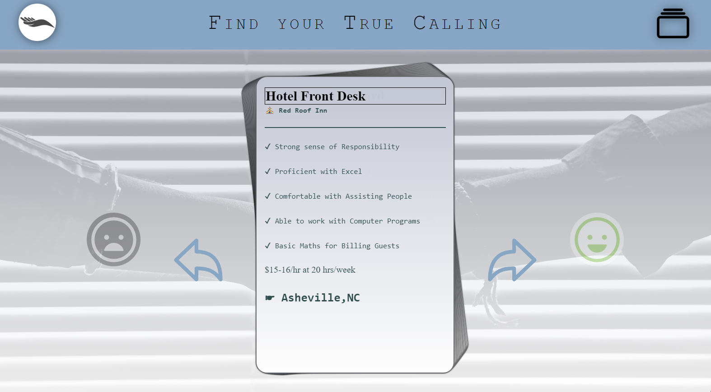

# HackNC Project: Job Board for the disable

Backend: Spring boot, H2 database

Frontend: thymleaf, Bootstrap

Snapshot of Interface:

## Ideas

- jobs for disability: depression? OCD? 洁癖? Mental Illness
- Inform people with disability about job availability for their disability
  - company post their disability accommodation
- Connect disability people with employer (unable to attend career fair)
- [https://www.healthline.com/health/anxiety/jobs-for-people-with-anxiety#jobs](https://www.healthline.com/health/anxiety/jobs-for-people-with-anxiety#jobs)

---

# Documentation

## Running the Application

1, The application should just run in Intellij after all the dependency in `pom.xml` is loaded

2, Run the Spirngboot Project

3, Open browser: http://localhost:8080

4, Exposing stage: http://localhost:8080/form

5, Searching stage: http://localhost:8080/job_cards

6, Connecting stage: http://localhost:8080/job_list

7, Deciding stage: http://localhost:8080/offer

## H2 Database console

Navigate to `[http://localhost:8080/h2-console](http://localhost:8080/h2-console)`

JDBC: `jdbc:h2:./src/main/resources/db/data`

Username: `sa`

Password: `password`

---

# Next Step

## H2

- Figure out how to run sql command on initial run
  - reason: .db file will not commit

---

# Resources

[Spring Boot Thymeleaf Tutorial For Beginners - YouTube](https://www.youtube.com/watch?v=hoVUmn8ZCOo)

[Introduction to Using Thymeleaf in Spring | Baeldung](https://www.baeldung.com/thymeleaf-in-spring-mvc)

[Spring Boot With H2 Database | Baeldung](https://www.baeldung.com/spring-boot-h2-database)

[Getting Started | Building a RESTful Web Service (spring.io)](https://spring.io/guides/gs/rest-service/)
